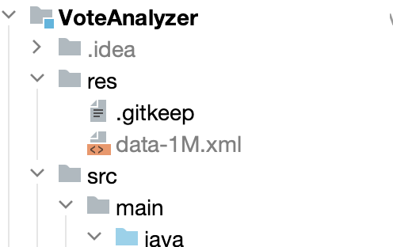

# Задание 1. Быстрая загрузка больших объёмов данных в базу
## Что нужно сделать
1. Просмотрите   [видео ](https://www.youtube.com/watch?v=Fyz-uYTvMns)
2. Перепишите проект **VoteAnalyzer** , чтобы он максимально быстро загружал в базу данных XML-файл размером 1,5 Гб. Используйте все знания, полученные в этом модуле.
3. Загрузите XML-файлы из [архива ](https://drive.google.com/file/d/1fzZSsWffheuzdzzmnkUuqrzgdCfm6dGF/view) в директорию res-проекта.
## Критерии оценки
Принято — файл 1,5 Гб загружается в базу данных, в программе используется:

1. SAX-механизм чтения XML-файлов (порционное чтение);
2. конкатенация строк при помощи StringBuilder;
3. загрузка данных в базу при помощи множественных INSERT’ов.

## Советы и рекомендации
Если при запуске приложения у вас возникает ошибка^:
Exception in thread "main" java.io.FileNotFoundException: …res/data-1M.xml (No such file or directory)
…убедитесь, что вы скопировали файл **data-1M.xml** из архива в директорию res. В дереве файлов в IntelliJ IDEA это должно выглядеть так:
